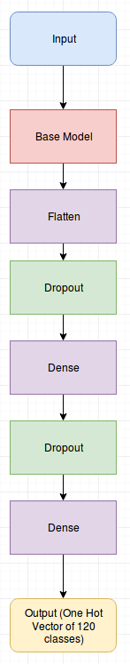
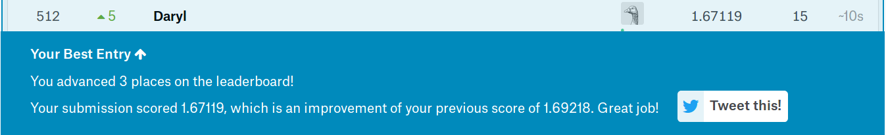

This repository contains my submission for the project requirement of EE 298F Deep Learning and Computer Vision.

## Project Details

I decided to join the Kaggle Challenge: *Dog Breed Identification*. The task is to identify the breed of the dog in the image.

The challenge here is that there are 120 classes of dogs but the provided training data is only 10222 images.

> [Here's the link](https://www.kaggle.com/c/dog-breed-identification)
## Dataset

The dataset is based on the Stanford dataset. It contains 10222 images.  

  

Norfolk Terrier

  

Norwich Terrier  

The *class distribution* of the dataset is shown in the image below.

  

## Data Preprocessing and Augmentation

To compensate the lack of enough training images. I used data augmentation. I implented it using the Keras' ImageDataGenerator.

I used the code dataprep.py to create the necessary directory that will be used for the ImageDataGenerator.

## Architecture

I used transfer learning for this project.

I used an existing architecture used in general classification as base model. I appended fully connected layers that will resize the shape that will be fit for the number of classes. An illustration of the architecture is shown in the figure below.

  

I experimented with different base models. I experimented with xception, inceptionV3 and resnet50.

Based on my experiments the resnet50 architecture gives me the lowest lost.

## Results

The kaggle challenge uses multiclass loss or categorical cross entropy loss as its scoring metric.

The best result I was able to get is shown in the image below.

  

# Usage

Download the dataset from the kaggle challenge. Here's the [link](https://www.kaggle.com/c/dog-breed-identification/data)
