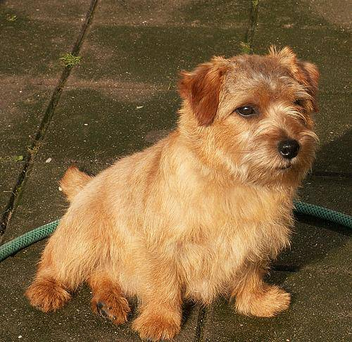
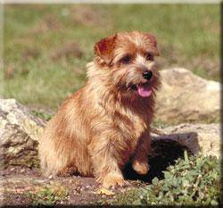

This repository contains my submission for the project requirement of EE 298F Deep Learning and Computer Vision.

## Project Details

I decided to join the Kaggle Challenge: *Dog Breed Identification*. It requires to identify the breed of the dog in the image.

The challenge here is that there are 120 classes of dogs but the provided training data is only 10222 images.

*Dataset*

The dataset is based on the Stanford dataset. It contains 10222 images of size 224 x 224.  

  

>Norfolk Terrier

  

>Norwich Terrier  

## Code Explanation

## Installation

Provide code examples and explanations of how to get the project.

## API Reference

Depending on the size of the project, if it is small and simple enough the reference docs can be added to the README. For medium size to larger projects it is important to at least provide a link to where the API reference docs live.

## Tests

Describe and show how to run the tests with code examples.

## Contributors

Let people know how they can dive into the project, include important links to things like issue trackers, irc, twitter accounts if applicable.

## License

A short snippet describing the license (MIT, Apache, etc.)
