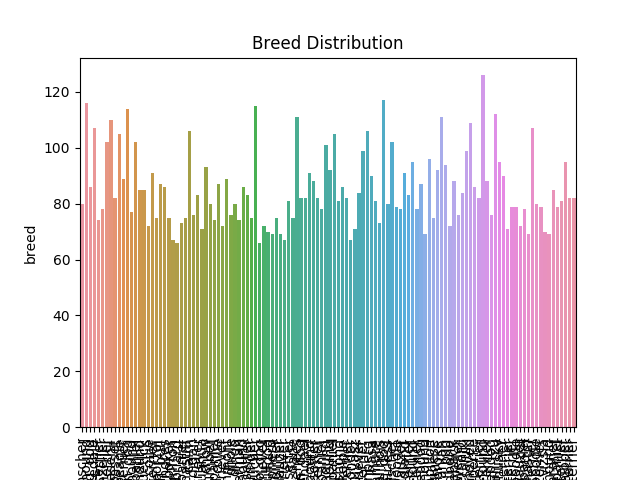

This repository contains my submission for the project requirement of EE 298F Deep Learning and Computer Vision.

## Project Details

I decided to join the Kaggle Challenge: *Dog Breed Identification*. The task is to identify the breed of the dog in the image.

The challenge here is that there are 120 classes of dogs but the provided training data is only 10222 images.

> Here's the [link](https://www.kaggle.com/c/dog-breed-identification) for the kaggle challenge.
## Dataset

The dataset is based on the Stanford dataset. It contains 10222 images.  

<p align="center"><br><br></p>
Norfolk Terrier

<p align="center"><br><br></p>
Norwich Terrier  

The *class distribution* of the dataset is shown in the image below.

<p align="center"><br><br></p>


## Data Preprocessing and Augmentation

To compensate the lack of enough training images, I implemented data augmentation using the Keras' ImageDataGenerator.

The necessary directory that will be used for the ImageDataGenerator was created using *dataprep.py*.

## Architecture

Since this is a classification task, I used transfer learning for this project. In transfer learning a known architecture that does well in a certain dataset is fine tuned to do classification task in another dataset.

I experimented with three different base models namely xception, inceptionV3 and resnet50. Fully connected layers were appended to the base model to resize the shape that will be fit for the number of classes. An illustration of the architecture is shown in the figure below.

<p align="center"><br><br></p>

Because of the low number of training image, the architecture was very prone to overfitting. To avoid this dropout layers were added.

The image data generator also serves as the generator for batch processing of training data to fit in the limited gpu memory.


## Experiments

During my initial tests I split the given data into a 9:1 train to validation ratio to have see if the network is overfitting.

I first tested experimented with different models. Tweaked the hyperparameters. The best scores I was able to get are summarized in the table below. The kaggle challenge uses multiclass loss or categorical cross entropy loss as its scoring metric.

The architecture were trained for 135 epochs. The best model based on the training loss was used for prediction.

<p align="center"><br><br></p>

## Results

Based on my experiments the resnet50 architecture gives the highest submission score.

I used the resnet50 as the base model for my architecture and continued training the network up to 200 epochs. I also removed the validation and used the entire dataset for training. The best result I was able to get is shown in the image below. The submission file is included in this repo as resnet50_complete_data_198e.csv

<p align="center"><br><br></p>

The loss is 1.67119 which is around 55% accuracy based on my training data.

The low score can be attributed to the low number of training image per class as seen in the class distribution plot. Even with data augmentation the network is having a hard time learning to classify between breeds. Another factor is that some breeds are very much similar in appearance as seen in the sample image above. Also the background of the training images are different from each other like the images below of the same breed.

<p align="center"><br><br></p>

<p align="center"><br><br></p>

Two training images of aghan hound.
## Usage

Run this script:
```
mkdir input
cd input
```
Then download the dataset from the kaggle challenge in this directory. Here's the [link](https://www.kaggle.com/c/dog-breed-identification/data) for the data. Extract train.zip and test.zip here.

Then execute this to clone the repo and format the data for the data generator:
```
cd ..
git clone https://github.com/darylperalta/ee298-proj
cd ee298-proj
python dataprep.py
```


Download the checkpoint of the model [here](https://drive.google.com/open?id=1mnFhXLOiYGoRgwh6TAeEeTtS3zWMKUCC).

For prediction, go to pred.py and edit checkpointpath to the path of the downloaded checkpoint. You can also change the pred_filename for the output submission filename.

Run **pred.py** to create predictions for the test data and output a submission file.

Submit the output csv file to the kaggle website to see the result.

The code used for train are:
  >resnet50_train.py for the architecture with resnet as its base model
  >xception_train.py for the architecture with xception as its base model
  >inceptionV3_train.py for the architecture with inceptionV3 as its base model
